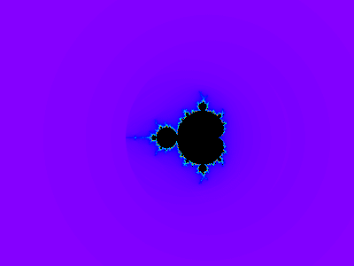

# Mandelbrot Media Generator

<div align="center">
	<p>
		
		
	</p>
    The Mandelbrot set is infinitely complex.<br>
    As the zoom increases, a completely unique fractal pattern is observed, likely to have never 
    been seen before. <br><br>
</div>

This software is used to generate gifs showing a zoom into the boundary of the Mandelbrot set. A complex number,
*c*, is determined to be in the Mandelbrot set if the
function&nbsp;&nbsp;*z*<sub>*n*＋1</sub> ＝ *z<sub>n</sub>*<sup>2</sup> ＋ *c*&nbsp;&nbsp;remains bounded when iterated, 
where&nbsp;&nbsp;*z*, *c* ∈ ℂ&nbsp;&nbsp;and&nbsp;&nbsp;*z<sub>0</sub>* ＝ 0. Complex numbers outside the set will diverge to infinity.  

For a given zoom, each pixel on the screen is mapped to a complex number corresponding to the pixel's position 
relative to the complex plane. If it is in the Mandelbrot set, the pixel is coloured black, and if not, the pixel's 
colour depends on the number of iterations required for the number to diverge. Divergence after a few 
iterations gives a blue colour, which becomes increasingly red-shifted as the number of iterations increases.


## How To Run

1. Clone the repo and navigate to its top level
```
git clone git@github.com:TomRaynes/Mandelbrot-Media-Generator.git
cd Mandelbrot-Media-Generator
```
2. To start the program:
```
./MMG
```

## Usage

- Move `Up` / `Down` / `Left` / `Right` with `W` / `S` / `A` / `D`  
  <br>
- `Zoom in` with `UP ARROW`  
  <br>
- `Zoom out` with `DOWN ARROW`  
  <br>
- `Reset` with `R`  
  <br>
- Toggle `show zoom` with `Z`  
  <br>
- Toggle `cursor control` with `C`  
  <br>
- Take `screenshot` with `I`  
  <br>
- `Generate gif` of zoom to current point with `ENTER`

Screenshots can be found in `Output/Images`  
Gifs can be found in `Output/Media`  
Frames of the previously generated gif can be found in `Output/Frames`  
